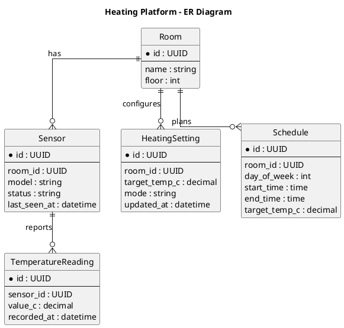

# Project_template

Это шаблон для решения проектной работы. Структура этого файла повторяет структуру заданий. Заполняйте его по мере работы над решением.

# Задание 1. Анализ и планирование

<aside>

Чтобы составить документ с описанием текущей архитектуры приложения, можно часть информации взять из описания компании и условия задания. Это нормально.

</aside

### 1. Описание функциональности монолитного приложения

**Управление отоплением:**

- включить и выключить отопление
- задавать целевую температуру для отдельных помещений
- просмпатрировать текущее состояние системы отопления
- Система поддерживает…
- централизваонное управление отоплением для всех помещений
- работу с несколькими датчиками температуры
- хранение текущих настроек и показаний датчиков

**Мониторинг температуры:**

- просматривать текущую температуру в помещениях
- получать обновленные значения температуры при каждом запросе 
- видеть список подключенных датчиков
- Система поддерживает...
- получение данных с датчиков температуры
- хранение информации о датчиках с привязкой к помещениям
- работу с историей показаний
  

### 2. Анализ архитектуры монолитного приложения

Текущее приложение реализовано как монолитное приложение с характеристиками: 
- написано на Go
- взаиможействие с СУБД напрямую из приложения
- единая кодовая база
- для взаимодействия с клиентами используется REST API
- нет четкого разделения на независимые модули и сервисы

Все функциональные части приложения разворачиваются и масштабирубтся как единое целое. Изменения в одной части системы требуют пересборки и повторного деплоя всего приложения

### 3. Определение доменов и границы контекстов

1. Домен управления отоплением
2. Домен мониторинга температуры
3. Домен управления датчиками
   


### **4. Проблемы монолитного решения**

- невозможно независимо масштабировать отдельные компоненты системы
- высокая степень связности компонентов
- сложность доработки и поддержки по мере роста функциональности
- любые изменения требуют пересборки приложения

Если вы считаете, что текущее решение не вызывает проблем, аргументируйте свою позицию.

### 5. Визуализация контекста системы — диаграмма С4

## C4 Context Diagram

Ниже контекстная диаграмма для монолитного приложения управления отоплением и мониторинга температуры.

```puml
@startuml
title Heating & Temperature Monitoring System - Context

top to bottom direction

!includeurl https://raw.githubusercontent.com/plantuml-stdlib/C4-PlantUML/master/C4_Context.puml

Person(user, "Пользователь", "Просматривает температуру, управляет отоплением в помещениях")
Person(admin, "Администратор", "Управляет датчиками и настройками системы")

System(system, "Система управления отоплением и мониторинга температуры", "Монолитное приложение на Go с REST API")

System_Ext(sensors, "Датчики температуры", "Передают показания температуры")
System_Ext(client, "Клиентские приложения", "Web/Mobile, используют REST API")

Rel(user, client, "Управляет отоплением, смотрит температуру")
Rel(admin, client, "Администрирует систему и датчики")
Rel(client, system, "REST API")
Rel(sensors, system, "Передают показания")

@enduml
```

# Задание 2. Проектирование микросервисной архитектуры

В этом задании вам нужно предоставить только диаграммы в модели C4. Мы не просим вас отдельно описывать получившиеся микросервисы и то, как вы определили взаимодействия между компонентами To-Be системы. Если вы правильно подготовите диаграммы C4, они и так это покажут.

**Диаграмма контейнеров (Containers)**

## C4 Container Diagram

```puml
@startuml
title Heating Platform - Containers (To‑Be)

top to bottom direction

!includeurl https://raw.githubusercontent.com/plantuml-stdlib/C4-PlantUML/master/C4_Container.puml

Person(user, "Пользователь", "Управляет отоплением и просматривает температуру")
Person(admin, "Администратор", "Управляет настройками и датчиками")

System_Boundary(system, "Heating Platform") {
  Container(web, "Web UI", "SPA", "Интерфейс для управления отоплением и мониторинга")
  Container(mobile, "Mobile App", "iOS/Android", "Управление отоплением и просмотр температуры")

  Container(heating, "Heating Service", "Go", "Управление отоплением и режимами")
  Container(monitoring, "Temperature Monitoring Service", "Go", "Сбор и выдача температурных данных")
  Container(sensor, "Sensor Management Service", "Go", "Регистрация, привязка и состояние датчиков")

  ContainerDb(heatingDb, "Heating DB", "PostgreSQL", "Настройки и расписания отопления")
  ContainerDb(tempDb, "Temperature DB", "PostgreSQL", "Текущие и исторические показания")
  ContainerDb(sensorDb, "Sensor DB", "PostgreSQL", "Информация о датчиках и помещениях")

  Container(apiGateway, "API Gateway", "Nginx/Go", "Единая точка входа для клиентов")
}

System_Ext(sensors, "Датчики температуры", "Передают показания по HTTP/MQTT")

Rel(user, web, "Использует")
Rel(user, mobile, "Использует")
Rel(admin, web, "Администрирует")
Rel(admin, mobile, "Администрирует")

Rel(web, apiGateway, "REST")
Rel(mobile, apiGateway, "REST")

Rel(apiGateway, heating, "REST/JSON")
Rel(apiGateway, monitoring, "REST/JSON")
Rel(apiGateway, sensor, "REST/JSON")

Rel(sensors, monitoring, "Отправляют показания")
Rel(sensors, sensor, "Регистрируются/передают метаданные")

Rel(heating, heatingDb, "CRUD")
Rel(monitoring, tempDb, "CRUD")
Rel(sensor, sensorDb, "CRUD")

@enduml
```
**Диаграмма компонентов (Components)**

## C4 Component Diagrams

### Heating Service

```puml
@startuml
title Heating Service - Components

top to bottom direction

!includeurl https://raw.githubusercontent.com/plantuml-stdlib/C4-PlantUML/master/C4_Component.puml

Container_Boundary(heating, "Heating Service") {
  Component(api, "Heating API", "REST Controller", "Принимает команды управления")
  Component(scheduler, "Schedule Manager", "Service", "Обработка расписаний отопления")
  Component(ruleEngine, "Target Temp Engine", "Service", "Применение целевых температур по помещениям")
  Component(stateRepo, "Heating State Repo", "Repository", "Хранение текущих настроек")
}

ContainerDb(heatingDb, "Heating DB", "PostgreSQL", "Настройки и расписания")

Rel(api, scheduler, "Вызывает")
Rel(api, ruleEngine, "Вызывает")
Rel(scheduler, stateRepo, "Читает/пишет")
Rel(ruleEngine, stateRepo, "Читает/пишет")
Rel(stateRepo, heatingDb, "CRUD")

@enduml
```

### Temperature Monitoring Service

```puml
@startuml
title Temperature Monitoring Service - Components

top to bottom direction

!includeurl https://raw.githubusercontent.com/plantuml-stdlib/C4-PlantUML/master/C4_Component.puml

Container_Boundary(monitoring, "Temperature Monitoring Service") {
  Component(api, "Monitoring API", "REST Controller", "Выдача данных по температуре")
  Component(collector, "Sensor Data Collector", "Service", "Прием и обработка показаний")
  Component(history, "History Service", "Service", "Работа с историей показаний")
  Component(tempRepo, "Temperature Repo", "Repository", "Доступ к данным температур")
}

ContainerDb(tempDb, "Temperature DB", "PostgreSQL", "Текущие и исторические показания")

Rel(api, history, "Запрашивает данные")
Rel(collector, tempRepo, "Записывает")
Rel(history, tempRepo, "Читает")
Rel(tempRepo, tempDb, "CRUD")

@enduml
```

### Sensor Management Service

```puml
@startuml
title Sensor Management Service - Components

top to bottom direction

!includeurl https://raw.githubusercontent.com/plantuml-stdlib/C4-PlantUML/master/C4_Component.puml

Container_Boundary(sensor, "Sensor Management Service") {
  Component(api, "Sensor API", "REST Controller", "Регистрация и управление датчиками")
  Component(registry, "Sensor Registry", "Service", "Привязка датчиков к помещениям")
  Component(health, "Sensor Health Monitor", "Service", "Отслеживание состояния датчиков")
  Component(sensorRepo, "Sensor Repo", "Repository", "Доступ к данным датчиков")
}

ContainerDb(sensorDb, "Sensor DB", "PostgreSQL", "Датчики и помещения")

Rel(api, registry, "Вызывает")
Rel(api, health, "Вызывает")
Rel(registry, sensorRepo, "Читает/пишет")
Rel(health, sensorRepo, "Читает/пишет")
Rel(sensorRepo, sensorDb, "CRUD")

@enduml
```
**Диаграмма кода (Code)**

## C4 Code Diagram

```puml
@startuml
title Heating Service - Code (Example)

top to bottom direction

!includeurl https://raw.githubusercontent.com/plantuml-stdlib/C4-PlantUML/master/C4_Code.puml

Boundary(heating, "Heating Service") {
  Class(HeatingController, "HeatingController", "Handle REST requests")
  Class(ScheduleService, "ScheduleService", "Manage heating schedules")
  Class(TargetTempService, "TargetTempService", "Apply target temperatures")
  Class(HeatingRepository, "HeatingRepository", "Data access")
}

Rel(HeatingController, ScheduleService, "calls")
Rel(HeatingController, TargetTempService, "calls")
Rel(ScheduleService, HeatingRepository, "reads/writes")
Rel(TargetTempService, HeatingRepository, "reads/writes")

@enduml
```
# Задание 3. Разработка ER-диаграммы

# ER Diagram


# Задание 4. Создание и документирование API

### 1. Тип API

Для взаимодействия микросервисов используется REST API 

Обоснование выбора:

REST API хорошо подходит для синхронных запросов к ресурсам (устройства, дома, состояния, команды).

Использование стандартных HTTP-методов (GET, POST, PATCH) делает взаимодействие простым, понятным и широко поддерживаемым

OpenAPI позволяет формально зафиксировать контракт API, упростить разработку, тестирование и интеграцию сервисов

При этом некоторые операции (например, отправка команд устройствам) логически обрабатываются асинхронно на стороне сервиса, что отражается через HTTP-статус 202 Accepted, однако сам API-контракт остаётся синхронным REST API.

### 2. Документация API

[Здесь приложите ссылки на документацию API для микросервисов, которые вы спроектировали в первой части проектной работы. Для документирования используйте Swagger/OpenAPI или AsyncAPI.
](https://app.swaggerhub.com/apis/efc/warmrest/1.0.0)

# Задание 5. Работа с docker и docker-compose

Перейдите в apps.

Там находится приложение-монолит для работы с датчиками температуры. В README.md описано как запустить решение.

Вам нужно:

1) сделать простое приложение temperature-api на любом удобном для вас языке программирования, которое при запросе /temperature?location= будет отдавать рандомное значение температуры.

Locations - название комнаты, sensorId - идентификатор названия комнаты

```
	// If no location is provided, use a default based on sensor ID
	if location == "" {
		switch sensorID {
		case "1":
			location = "Living Room"
		case "2":
			location = "Bedroom"
		case "3":
			location = "Kitchen"
		default:
			location = "Unknown"
		}
	}

	// If no sensor ID is provided, generate one based on location
	if sensorID == "" {
		switch location {
		case "Living Room":
			sensorID = "1"
		case "Bedroom":
			sensorID = "2"
		case "Kitchen":
			sensorID = "3"
		default:
			sensorID = "0"
		}
	}
```

2) Приложение следует упаковать в Docker и добавить в docker-compose. Порт по умолчанию должен быть 8081

3) Кроме того для smart_home приложения требуется база данных - добавьте в docker-compose файл настройки для запуска postgres с указанием скрипта инициализации ./smart_home/init.sql

Для проверки можно использовать Postman коллекцию smarthome-api.postman_collection.json и вызвать:

- Create Sensor
- Get All Sensors

Должно при каждом вызове отображаться разное значение температуры

Ревьюер будет проверять точно так же.


